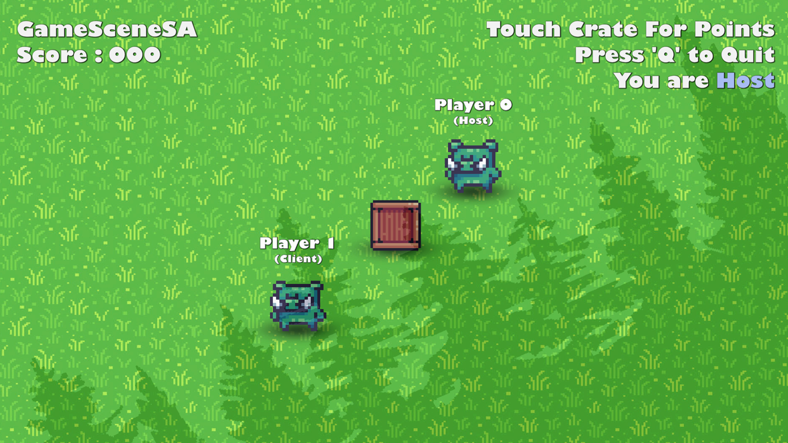

# Unity Multiplayer Playground 2D - Netcode For GameObjects (NGO)

This repo demonstrates Unity Multiplayer with 2D via Unity's [Netcode For Game Objects](https://docs-multiplayer.unity3d.com/netcode/current/about/) (NGO).

**TLDR;**
* Check out the [ending point](#Ending-Point), which took about 8-10 hours total from initial planning through completion of development
* Download and play the **server-authoritative** demo
* Read the [notes](#notes), [challenges](#challenges), and [possible improvements](#possible-improvements)

**Table Of Contents**
1. [Getting Started](#getting-started)
1. [Overview](#overview)
1. [Details](#details)
1. [Resources](#resources)

# Getting Started

1. Download this repo (*.zip or *.git)
1. Download the [Unity Editor](https://store.unity.com/#plans-individual) (See `Unity Version` below)
1. Open this repo in the Unity Editor
1. Choose one of the Scenes...
  - For single-player:
    - Play the scene
    - Use arrow keys to move
    - Enjoy!
  - For multiplayer:
    - Set **only** that one Scene in the build settings. Build the app. (See `Unity Target` below)
    - Open the first build instance. Click 'H' for host
    - Open 1 or more other build instances. Click 'C' for client
    - Use arrow keys to move
    - Enjoy! 

# Overview

## Features

### Starting Point
This repo started as a fork of my own [Github.com/SamuelAsherRivello/unity-project-template](https://github.com/SamuelAsherRivello/unity-project-template) project. It contains "Unity Best Practices for Project Structure and C# Coding Standards". It is a recommended starting point for new projects.

### Ending Point

This repo includes various versions of similar gameplay. There is a playable character and a crate in a playful environment. Use the arrow keys to move.

The demos required **8-10 hours total**, from initial planning through completion of development.

* [Version 01 - Single Player](./Unity/Assets/Game/Version01_SinglePlayer) - Simplest playground, without multiplayer
* [Version 02 - Multiplayer CA](./Unity/Assets/Game/Version02_MultiplayerCA) - Intermediate playground, with **client authoritative** multiplayer
* [Version 03 - Multiplayer SA](./Unity/Assets/Game/Version03_MultiplayerSA) - Advanced playground, with **server authoritative** multiplayer

#### Notes

The client-authoritative approach represents a quick and dirty way to get started and prototype, while the server-authoritative approach represents the real-world solution path for a commercial multiplayer game. But I like the academic challenge of exploring both at the same time, adding features, and keeping feature parity. For future prototypes, I'll likely use only server-authoritative. 

Apparently, the "com.unity.netcode" package creates a "DefaultNetworkPrefabs" asset. No problem. However, its created at the root of the `Assets` folder, and it cannot be safely moved to a subfolder.  I don't like that. 

#### Challenges

I enjoyed iterating on the game versions from single-player to server-authoritative multiplayer, but there were some challenges along the way.

1. Choosing to create multiple versions at once introduced some organizational and structural challenges. I first tried to keep each version's assets completely distinct. But that proved to be too much of a redundancy (e.g., copies of Sprites). So, I chose the `Game` folder vs `Shared` folder approach. Works well.
1.  Between the **multiplayer versions**, it would be intuitive to have my custom classes extend each other (e.g. PlayerCA.cs and PlayerSA.cs extend some non-existent BasePlayer.cs), but I chose to keep the custom class structure flatter and simply duplicate logic via copy/paste. This way, each game version is (more) self-contained.
1. The **QuickLobby** is purposefully lean. It has some bugs when (very rapidly) joining/quitting with many app instances. 
1. The **QuickLobby** is purposefully limited. It supports multiple app instances running on **only** one PC. A more robust version would allow each player to be on a unique PC. Using Unity's optional services (e.g. Matchmaking, Lobby, Relay) would help.
1. I notice bugs if I spawn an app instance and leave it open, then continue to do more development and play the newer Unity Editor vs. the older app instances. I think the NetworkObject IDs of the crate, for example, fall out of sync. Rebuilding all app instances solves the issue. I'd like to know more about workarounds to understand exactly when rebuilding a new app instance is really needed and when it's not.

  
#### Possible Improvements

With infinite time, some additional improvements can be made. Some would be especially fun.

1. I'd like to have a unique character appearance per app instance. Solution path, likely: Don't automatically spawn a player prefab. Instead capture the player connecting and spawn a unique prefab per player. Using a base player prefab and per-character player prefab variants could help the workflow.
1. I'd like to show all player's scores onscreen for all app instances. Solution path, likely: Have the host listen to a NetworkVariable change for the score for all clients, and then concatenate the results for display onscreen.
1. I'd like to make a build tool that when I hit Control-B to build, it automatically puts the currently active Scene as the FIRST index in the build settings. This would facilitate multiplayer testing so the active Scene in the Unity Editor matches the active Scene in the built app.

## Bonus Content

The supporting material (video & slides) required **additional** creation time beyond the timeline for the content above.

### Videos

This **Unity Project** is featured in the following YouTube video.

<table>
<tr>
<th>Unity Multiplayer Playground 2D | Netcode For GameObjects (NGO)</th>
</tr>
<tr>
<td>

</td>
</tr>
</table>

# Details

**Documentation**
* `ReadMe.md` - The primary documentation for this repo
* `Unity/Assets/Documentation/ReadMe.asset` - Select this asset in Unity to get started

**Configuration**
* `Unity Target` - [Standalone MAC/PC](https://support.unity.com/hc/en-us/articles/206336795-What-platforms-are-supported-by-Unity-)
* `Unity Version` - Use this [Version](./Unity/ProjectSettings/ProjectVersion.txt)
* `Unity Rendering` - [Universal Render Pipeline (URP)](https://docs.unity3d.com/Manual/universal-render-pipeline.html)
* `Unity Aspect Ratio` - [Game View 10x16](https://docs.unity3d.com/Manual/GameView.html)

**Structure**
* `Unity` - Open this folder in the Unity Editor
* `Unity/Assets/Game/` - Several game versions exist. Open any Scene. Press 'Play'!
* `Unity/Assets/Shared/` - These are shared assets used across several game versions.

**Dependencies**
* `Various` - Already included via [Unity Package Manager](https://docs.unity3d.com/Manual/upm-ui.html) as this [Version](./Unity/Packages/manifest.json)

----

=============

# Resources 

## Links

#### Best Practices
* Samuel Asher Rivello's Medium Article - <a href="https://sam-16930.medium.com/unity-project-structure-a694792cefed">Unity — Project Structure Best Practices</a>
* Samuel Asher Rivello's Medium Article - <a href="https://sam-16930.medium.com/coding-standards-in-c-39aefee92db8">Unity — C# Coding Standards</a>

#### Unity Web3
* Samuel Asher Rivello's Web3 Portfolio - <a href="https://samuelasherrivello.com/web3-portfolio">SamuelAsherRivello.com/web3-portfolio</a>
* Samuel Asher Rivello's Web3 Article - <a href="https://sam-16930.medium.com/unity-web3-for-game-development-cde33bc27c50">Unity — Web3 For Game Development</a>
* Samuel Asher Rivello's Web3 Repos - <a href="https://github.com/SamuelAsherRivello/intro-to-web3-for-unity">Intro To Web3 For Unity (Students Only)</a>

#### Unity Courses
* Samuel Asher Rivello's Udemy Course - <a href="https://bit.ly/physics-for-unity-2022-on-udemy">Physics For Unity</a>
* Samuel Asher Rivello's Udemy Course - <a href="https://bit.ly/unit-testing-for-unity-course">Unit Testing For Unity</a>
* Samuel Asher Rivello's Udemy Course - <a href="https://bit.ly/mvc-architecture-for-unity-on-udemy">MVC Architecture For Unity</a>

## Created By

- Samuel Asher Rivello 
- Over 25 years XP with game development (2024)
- Over 11 years XP with Unity (2024)

## Contact

- Twitter - <a href="https://twitter.com/srivello/">@srivello</a>
- Git - <a href="https://github.com/SamuelAsherRivello/">Github.com/SamuelAsherRivello</a>
- Resume & Portfolio - <a href="http://www.SamuelAsherRivello.com">SamuelAsherRivello.com</a>
- LinkedIn - <a href="https://Linkedin.com/in/SamuelAsherRivello">Linkedin.com/in/SamuelAsherRivello</a> <--- Say Hello! :)

